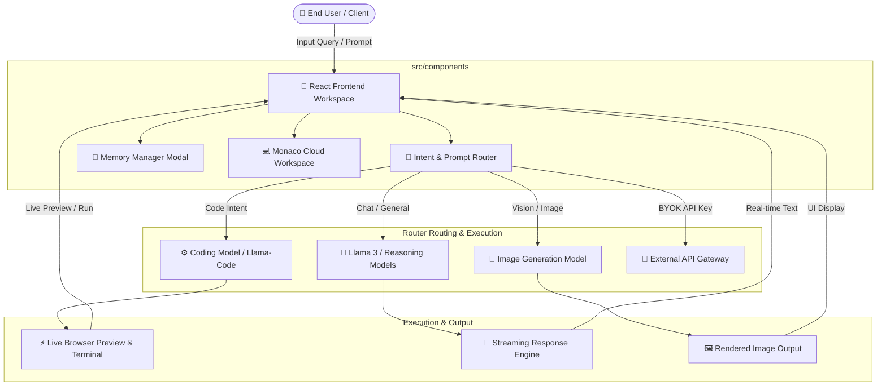

# 🚀 Aseer AI (AETHER-OS) – Enterprise Multi-Model AI Orchestrator & Live Execution Environment

[](https://vercel.com)
[](LICENSE)
[](https://reactjs.org/)
[](https://python.org)

**Aseer AI (AETHER-OS)** is an enterprise-grade, privacy-centric AI orchestration platform and interactive cloud execution workspace. Built to break the limitations of single-model AI interfaces, Aseer features a dynamic **Semantic Router Engine** that intelligently classifies user intents (code execution, image generation, multi-turn reasoning, data analytics) and dispatches requests to specialized models in real time.

---

## 🌟 Executive Summary & Key Highlights

- 🧠 **Dynamic Intent-Based Routing:** Seamlessly switches between models (Llama, DeepSeek, Phidma, Custom Fine-tunes) based on prompt heuristics without manual selection.
- 💻 **Embedded Monaco IDE & Cloud Sandbox:** Generates multi-file codebases, offers live terminal output, instant HTML/CSS/JS web previews, and code execution.
- 💾 **Context-Aware Memory System:** Persistent user memory manager (`MemoryManagerModal.jsx`) allowing deep context retention across historical chats and project sessions.
- 🔑 **Bring Your Own Key (BYOK) & Custom Endpoints:** Flexible user API key integration across third-party models alongside built-in tier management (`Free`, `Pro`, `Premium`).
- 📊 **Enterprise Analytics & Notifications:** Integrated real-time telemetry dashboard (`AnalyticsDashboard.jsx`), status feedback loops, and alert center (`NotificationCenter.jsx`).

---

## 🏗 System Architecture & Data Flow



---

## 🗂 Project Directory Tree

```
AETHER-OS/
├── main.py                     # Primary Python Backend Router & Orchestrator
└── aether-os/
    ├── api/
         ├──generate.js         # Serverless Functions & API Endpoints
    ├── public/                 # Static Assets & Icons
    ├── config/                 # Platform Configurations
    │   ├── modelsData.js       # AI Models Mapping & Dynamic Routes
    │   └── paymentConfig.js    # Tiered Pricing & Monetization Rules
    └── src/
        ├── assets/             # Brand Assets & UI Graphics
        └── components/         # Modular React Components
            ├── AnalyticsDashboard.jsx   # Real-time Telemetry & Usage Metrics
            ├── AuthModal.jsx            # User Authentication & Session Management
            ├── ChatSidebar.jsx          # Pinning, Folders, & Chat History
            ├── Dashboard.jsx            # Main Platform Control Center
            ├── FloatingOrb.jsx          # Interactive AI Status Visualizer
            ├── Footer.jsx               # Platform Footer & Links
            ├── Hero.jsx                 # Landing Page Hero Section
            ├── MemoryManagerModal.jsx   # Context & Long-term Memory Control
            ├── ModelsSection.jsx        # Model Selector & BYOK Setup
            ├── Navbar.jsx               # Top Navigation & Quick Controls
            ├── NavigationModals.jsx     # Workspace Navigation Overlays
            ├── NotificationCenter.jsx   # Real-time System Alerts
            ├── PaymentModal.jsx         # Stripe / Gateway Payment Integration
            ├── PricingModal.jsx         # Tier Limits (Free, Pro, Premium)
            ├── QuickActions.jsx         # One-click Shortcuts & Prompt Presets
            └── Workspace.jsx            # Full Monaco IDE & Live Execution Sandbox
```

---

## ⚡ Technical Stack

- **Core Engine & Backend:** Python (`main.py`), Serverless API Handlers (`/api`), Node.js
- **Frontend Architecture:** React.js, Tailwind CSS, Lucide Icons, Framer Motion
- **IDE Execution Engine:** Monaco Editor, Web Workers, Custom In-Browser Preview & Terminal Sandbox
- **State & Storage:** Persistent Local Context, Custom Memory Handler, Router Rules Engine
- **Deployment & CI/CD:** Vercel (Auto-deploy on `git push`), GitHub Actions

---

## 📖 Documentation Index

For detailed engineering guides and specifications, refer to:

- [ARCHITECTURE.md](./ARCHITECTURE.md) – Deep dive into component architecture and data routing.
- [API.md](./API.md) – Complete REST & Streaming API endpoint specifications.
- [DEPLOYMENT.md](./DEPLOYMENT.md) – Local development setup and cloud deployment steps.
- [ROADMAP.md](./ROADMAP.md) – Feature pipeline and future release schedule.
- [CONTRIBUTING.md](./CONTRIBUTING.md) – Guidelines for developer contributions.
- [SECURITY.md](./SECURITY.md) – Vulnerability reporting and security policies.

---

Developed with ❤️ by **Matthew** — *Built for Next-Generation AI Workflows*.
